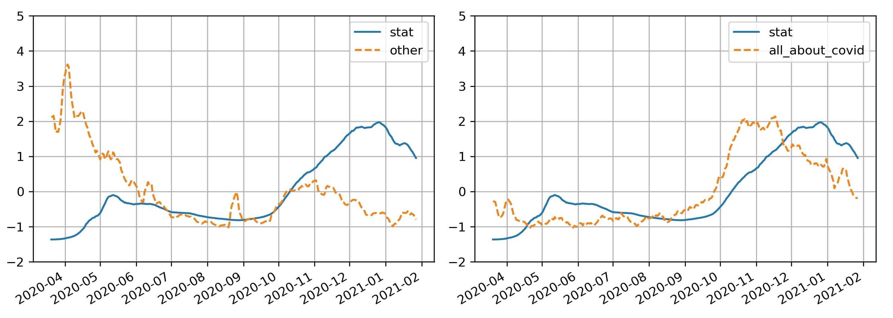

# COVID-19-tweets-Russia
This repository provides code and additional materials of the paper: "The Russian language corpus and a neural network to analyse Internet tweet reports about Covid-19".

One of the features we analyze is the number of tweets where Internet users report having Covid-19 symptoms. Extraction of such tweets from the Internet is complicated due to the lack of a Russian-language tweet dataset which is needed for training the machine learning models to automatically extract this category of tweets, so we focused on creating the first tool for the classification of the coronavirus mentioning in the texts of Russian-language tweets.

Data
---

We collected three types of data:
1. Annotated part (9,860: train -- 5,916, valid -- 1,972, test -- 1,972);
	We collected Russian-language tweets containing the word "covid" that were published from 01 Mar 2020 to 01 Mar 2021 and randomly selected 10,000 messages from them for a manual annotation.
	Annotators labeled messages, dividing them into 5 classes:
	- potential_covid_high_confidence -- potentially has coronavirus with high probability;
	-potential_covid_low_confidence -- potentially has coronavirus with low probability;
	- had_covid_high_confidence -- had coronavirus with high probability;
	- had_covid_low_confidence -- had coronavirus with low probability;
	- other -- mention coronavirus but don't refer to a potential case of the author or his\textbackslash her relatives

2. Unlabeled part with tweets from users from large regions of Russia (total 705,453 tweets for a 15 largest regional center of Russia).
	The search was provided using different word forms of 58 manually selected keywords on Russian related to the topic of coronavirus infection (including: "PCR", "pandemic", "self-isolation", etc.).
	The affiliation of a tweet to one of the regions was determined in two ways: 
	- the text of the message directly mentions the capital of the region; 
	- there is a capital of the region in the field "home region" of the author's account.

3. Unlabeled part with tweets about covid for Language Model training (total 1,979,247 tweets);
	The data on keyword "covid" was expanded with texts containing  other words often occurred in hashtags on the Covid-19 pandemic: "covid", "stayhome", and "coronavirus" (here, these are translations of Russian words into English). This part includes all unique Russian-language tweets from the collected data (about 1M tweets). Since modern language models are usually multilingual, about 1M more tweets in other languages were added to this corpus using filtering procedures described above. Thus, in the unlabeled part of the collected data, there were about 2 million messages.

Links to tweets from the annotated part are available at ``./data/labeled_corpus_links.csv``. 
Links to tweets from unlabeled parts are uploaded to our cloud storage and are available [here](https://cloud.mail.ru/public/DCGH/feCmMZraE).
We can also provide data with the text of tweets for all parts of the data for this please contact us on email: sag111@mail.ru

Model
---

We used a language model based on [XLM-RoBERTA-large](https://arxiv.org/abs/1911.02116) from [our previous work](https://arxiv.org/abs/2105.00059)

It was additionally trained as a masked language model on an unmarked part of the corpus (about 2M tweets on the topic of coronavirus). The training was carried out during 1 epoch with standard hyperparameters from the transformers library (the model denoted as "covid-twitter-xlm-roberta-large").

This model is available on hugging face: https://huggingface.co/sagteam/covid-twitter-xlm-roberta-large/tree/main

This model was fine-tuned for the classification task. Two tasks were considered:
1) full set of tags (all) -- multilabel classification of tweets, while one tweet can be assigned to several tags;
2) binary classification (bin) -- binary classification into two classes: other and all_about_covid 
``class all_about_covid - combines 4 classes: potential_covid_high_confidence, potential_covid_low_confidence, had_covid_high_confidence, and had_covid_low_confidence``

This step is presented in jupyter notebook ``./notebooks/Fine-tuning_a_pre-trained_Language_Model.ipynb``
Before running the notebook, you need to download the data and place them in a folder ```./data/```.

Results
---

Our model based on the XLM-RoBERTa topology with additional training on corpus of unmarked tweets gives the F1 score of 0.85 on binary classification task ("potentially have covid & have covid now" vs "other").

In additional, the created "covid-twitter-xlm-roberta-large" model was used to classify tweets from the unlabeled part of the corpus.

The figure below shows the curves of numbers of infected people in whole Russia (Data for all regions of Russia was collected from the Yandex DataLens platform) and of tweets per day for period from 01 Mar 2020 to 01 Mar 2021. For each curve we standardized values by removing the mean and [scaling](https://scikit-learn.org/stable/modules/generated/sklearn.preprocessing.StandardScaler.html?highlight=scaler#sklearn.preprocessing.StandardScaler):



The daily dynamics of tweets about Covid filtered by the binary model to mentions of coronavirus disease are similar to the official statistics of COVID-19 cases in Russia for the same period. Thus the created model can be used for separating targeted tweets from the other tweets on the topic of COVID-19. 

Citing & Authors
---
If you have found our results helpful in your work, feel free to cite our publication and this repository as
```
@article{sboev2021russian,
  title={The Russian language corpus and a neural network to analyse Internet tweet reports about Covid-19},
  author={Sboev, Alexander and Moloshnikov, Ivan and Naumov, Alexander and Levochkina𝑎, Anastasia and Rybka𝑎, Roman},
  year={2021}
}
```

Contributions
---
Thanks to [@naumov-al](https://github.com/naumov-al) for adding this additional materials.
